# Implementación NIDS/NIPS con Suricata + (Alloy, Loki y Grafana)

Haremos uso de **tres máquinas virtuales** en Isard.

- Las tres tendrán como sistema operativo: **Ubuntu 24.04.3 LTS**

---

## 1. Máquinas virtuales y recursos

### 1.1 Máquina 1: Atacante (con entorno gráfico)

Se llamará: `isard@dosorio-atacanto`

Interfaces de red:

- **Default** 
- **Wireguard VPN** 
- **Personal1**  - IP `192.168.40.2`

Su netplan:
```conf
network:
    ethernets:
        enp1s0:
            dhcp4: true
        enp2s0:
            dhcp4: true
        enp3s0:
            dhcp4: false
            addresses: [192.168.40.2/24]
            routes:
              - to: 192.168.50.0/24
                via: 192.168.40.1
    version: 2
````

Recursos:

- **RAM:** 5GB
- **CPU:** 3

---

### 1.2 Máquina 2: Servidor Suricata (router entre subredes)

Se llamará: `isard@dosorio-suricata`

Interfaces de red:

- **Default** 
- **Wireguard VPN** 
- **Personal1** - IP `192.168.40.1` `enp3s0`
- **Personal2** - IP `192.168.50.1` `enp4s0`

Su netplan:
```conf
network:
    ethernets:
        enp1s0:
            dhcp4: true
        enp2s0:
            dhcp4: true
        enp3s0:
            dhcp4: false
            addresses: [192.168.40.1/24]
        enp4s0:
            dhcp4: false
            addresses: [192.168.50.1/24]
    version: 2
````

Recursos:

- **RAM:** 6GB
- **CPU:** 3

---

### 1.3 Máquina 3: Víctima (sin entorno gráfico)

Se llamará: `isard@dosorio-vistima`

Interfaces de red:

- **Default**
- **Wireguard VPN**
- **Personal2** - IP `192.168.50.2`


Su netplan:
```conf
network:
    ethernets:
        enp1s0:
            dhcp4: true
        enp2s0:
            dhcp4: true
        enp3s0:
            dhcp4: false
            addresses: [192.168.50.2/24]
            routes:
              - to: 192.168.40.0/24
                via: 192.168.50.1
    version: 2
````

Recursos:

- **RAM:** 5GB
- **CPU:** 2

---

## 2. Configuración del servidor Suricata como router

Para que la máquina Suricata pueda actuar como router entre ambas subredes, habilitaremos **IP forwarding**. Para ello, entraremos al fichero `/etc/sysctl.conf` y descomentaremos la siguiente línea para que funcione:

```conf
net.ipv4.ip_forward=1
````

Seguidamente, aplicamos los cambios con:

```bash
isard@dosorio-suricata:~$ sudo sysctl -p
net.ipv4.ip_forward = 1
```

---

## 3. Activación de nftables (servidor Suricata)

Lo siguiente es la instalación y activación de **nftables**. En nuestro caso, al estar usando un Ubuntu Server 24.04, ya lo tenemos instalado. En tal caso, lo que debemos asegurarnos es que esté activado. Para ello pondremos la siguiente orden:

```bash
isard@dosorio-suricata:~$ sudo systemctl enable nftables
Created symlink /etc/systemd/system/sysinit.target.wants/nftables.service → /usr/lib/systemd/system/nftables.service.
```

Y podemos comprobar su estado con:

```bash
isard@dosorio-suricata:~$ systemctl status nftables
● nftables.service - nftables
 	Loaded: loaded (/usr/lib/systemd/system/nftables.service; enabled; preset: enabled)
 	Active: active (exited) since Thu 2026-01-29 23:53:30 UTC; 30min ago
   	Docs: man:nft(8)
         	http://wiki.nftables.org
	Process: 354 ExecStart=/usr/sbin/nft -f /etc/nftables.conf (code=exited, status=0/SUCCESS)
   Main PID: 354 (code=exited, status=0/SUCCESS)
    	CPU: 19ms

Jan 29 23:53:30 dosorio-suricata systemd[1]: Finished nftables.service - nftables.
```

---

## 4. Ajustes de offloading (ethtool) en Suricata

En el servidor Suricata:

```bash
isard@dosorio-suricata:~$ sudo apt install -y ethtool
isard@dosorio-suricata:~$ sudo ethtool -K enp3s0 gro off lro off gso off tso off
isard@dosorio-suricata:~$ sudo ethtool -K enp4s0 gro off lro off gso off tso off
```

Haciendo esto, evitamos falsos negativos/positivos y comportamientos extraños con checksums/segmentación.

---

## 5. Verificación de conectividad (pings)

Ahora comprobamos que haga ping tanto desde el atacante como desde el cliente, así verificamos su conexión.

### 5.1 Ping desde el atacante a la víctima

```bash
isard@dosorio-atacanto:~$ ping 192.168.50.2
PING 192.168.50.2 (192.168.50.2) 56(84) bytes of data.
64 bytes from 192.168.50.2: icmp_seq=1 ttl=63 time=15.7 ms
64 bytes from 192.168.50.2: icmp_seq=2 ttl=63 time=4.18 ms
^C
--- 192.168.50.2 ping statistics —
2 packets transmitted, 2 received, 0% packet loss, time 1002ms
rtt min/avg/max/mdev = 4.179/9.934/15.689/5.755 ms
```

### 5.2 Ping desde la víctima al atacante

```bash
isard@dosorio-vistima:~$ ping 192.168.40.2
PING 192.168.40.2 (192.168.40.2) 56(84) bytes of data.
64 bytes from 192.168.40.2: icmp_seq=1 ttl=63 time=3.47 ms
^C
--- 192.168.40.2 ping statistics ---
1 packets transmitted, 1 received, 0% packet loss, time 0ms
rtt min/avg/max/mdev = 3.468/3.468/3.468/0.000 ms
```

---

## 6. Instalación de Suricata (modo IDS)

Para iniciar con el proceso, haremos la instalación de Suricata utilizando el siguiente comando:

```bash
isard@dosorio-suricata:~$ sudo apt install suricata suricata-update
```

Seguidamente, actualizaremos las reglas (ET/Open rules) con:

```bash
isard@dosorio-suricata:~$ sudo suricata-update
```

---

## 7. Configuración de Suricata (suricata.yaml)

Una vez hecho esto, podemos proseguir con la configuración de Suricata. Para ello, editaremos el fichero principal de configuración con el siguiente comando:

```bash
isard@dosorio-suricata:~$ sudo nano /etc/suricata/suricata.yaml
```

### 7.1 Definir HOME_NET (ambas redes)

Dentro del archivo, debemos definir ambas redes en `HOME_NET` dentro del apartado `vars`, para que Suricata identifique correctamente el tráfico interno.

```yaml
vars:
  # more specific is better for alert accuracy and performance
  address-groups:
	HOME_NET: "[192.168.40.0/24,192.168.50.0/24]"
	#HOME_NET: "[192.168.0.0/16]"
	#HOME_NET: "[10.0.0.0/8]"
	#HOME_NET: "[172.16.0.0/12]"
	#HOME_NET: "any"

	EXTERNAL_NET: "!$HOME_NET"
```

### 7.2 Activar logs en formato EVE JSON (para Loki/Grafana)

Una vez añadidas ambas redes, activaremos los logs con formato **eve json** para luego usar con el software de Loki y Grafana. En el mismo archivo de configuración, debemos buscar el apartado de `outputs` y dejar las líneas de la siguiente forma, indicando la ruta donde estará el archivo `eve.json`:

```yaml
outputs:
  # a line based alerts log similar to Snort's fast.log
  - fast:
  	enabled: yes
  	filename: fast.log
  	append: yes
  	#filetype: regular # 'regular', 'unix_stream' or 'unix_dgram'

  # Extensible Event Format (nicknamed EVE) event log in JSON format
  - eve-log:
  	enabled: yes
  	filetype: regular #regular|syslog|unix_dgram|unix_stream|redis
  	filename: /var/log/suricata/eve.json
```

### 7.3 Validación de configuración

Una vez hecho esto, procedemos a guardar, salir y verificar que la configuración es correcta. Para ello usaremos el siguiente comando:

```bash
isard@dosorio-suricata:~$ sudo suricata -T -c /etc/suricata/suricata.yaml
i: suricata: This is Suricata version 7.0.3 RELEASE running in SYSTEM mode
i: suricata: Configuration provided was successfully loaded. Exiting.
```

### 7.4 Reinicio del servicio y verificación

Seguidamente, y tras comprobar que la configuración se ha cargado correctamente, procedemos a reiniciar el servicio y comprobar su estado:

```bash
isard@dosorio-suricata:~$ sudo systemctl restart suricata
isard@dosorio-suricata:~$ systemctl status suricata
● suricata.service - Suricata IDS/IDP daemon
 	Loaded: loaded (/usr/lib/systemd/system/suricata.service; enabled; preset: enabled)
 	Active: active (running) since Fri 2026-01-30 00:39:41 UTC; 4s ago
   	Docs: man:suricata(8)
         	man:suricatasc(8)
         	https://suricata.io/documentation/
	Process: 2893 ExecStart=/usr/bin/suricata -D --af-packet -c /etc/suricata/suricata.yaml --pidfile /run/suricata.pid (c>
   Main PID: 2896 (Suricata-Main)
  	Tasks: 1 (limit: 7013)
 	Memory: 181.0M (peak: 181.0M)
    	CPU: 4.662s
 	CGroup: /system.slice/suricata.service
         	└─2896 /usr/bin/suricata -D --af-packet -c /etc/suricata/suricata.yaml --pidfile /run/suricata.pid

Jan 30 00:39:41 dosorio-suricata systemd[1]: Starting suricata.service - Suricata IDS/IDP daemon...
Jan 30 00:39:41 dosorio-suricata suricata[2893]: i: suricata: This is Suricata version 7.0.3 RELEASE running in SYSTEM mode
Jan 30 00:39:41 dosorio-suricata suricata[2893]: W: ioctl: Failure when trying to get MTU via ioctl for 'eth0': No such de>
Jan 30 00:39:41 dosorio-suricata systemd[1]: Started suricata.service - Suricata IDS/IDP daemon.
lines 1-18/18 (END)
```

---

## 8. Cambio de modo IDS a IPS (Suricata inline con NFQUEUE)

Una vez hemos comprobado que Suricata está funcionando como IDS, debemos hacer que actúe como un IPS, permitiendo tanto la detección como también el bloqueo del tráfico malicioso. Para ello, usaremos Suricata con nftables, de forma que todo el tráfico que circule desde la máquina atacante hacia la máquina víctima pueda ser vigilado.

Lo que usaremos para esta integración será **NFQUEUE**, el cual posibilita que nftables le dé a Suricata la decisión de aceptar o descartar determinados paquetes.

Para conseguir esto, debemos configurar Suricata en modo inline, modificando de nuevo el archivo de configuración principal. Para ello, usaremos el siguiente comando:

```bash
isard@dosorio-suricata:~$ sudo nano /etc/suricata/suricata.yaml
```

### 8.1 Configuración NFQUEUE

Una vez dentro, procederemos a configurar el uso de NFQUEUE, lo que permitirá que el motor de detección pueda decidir si un paquete debe ser aceptado o descartado.

Para ello, debemos localizar cualquier configuración previa relacionada con `af-packet` y dejarla comentada o deshabilitada, ya que este modo no es compatible con el funcionamiento inline mediante NFQUEUE.

Una vez comentadas las líneas que no son compatibles (que suelen ser `af-packet`, `af-xdp` y `pcap`), añadiremos lo siguiente abajo del todo:

```yaml
nfqueue:
  - id: 0
    mode: accept
    fail-open: yes
```

Esto le dice a Suricata que va a recibir paquetes desde nftables y decidirá si pasan o se bloquean. De esta forma, solo trabajará con NFQUEUE y no intentará capturar tráfico directamente desde las interfaces.

### 8.2 Validación tras cambios

Una vez añadido, guardamos, salimos y comprobamos que la configuración se carga correctamente con:

```bash
isard@dosorio-suricata:~$ sudo suricata -T -c /etc/suricata/suricata.yaml
i: suricata: This is Suricata version 7.0.3 RELEASE running in SYSTEM mode
i: suricata: Configuration provided was successfully loaded. Exiting.
```

### 8.3 Error al reiniciar y diagnóstico

Procedemos a reiniciar el servicio y verificar su estado:

```bash
isard@dosorio-suricata:~$ sudo systemctl restart suricata
Job for suricata.service failed because the control process exited with error code.
See "systemctl status suricata.service" and "journalctl -xeu suricata.service" for details.
```

Durante la configuración de Suricata como IPS, surgieron varios problemas relacionados con el modo de captura y el arranque del servicio. Inicialmente, Suricata seguía iniciándose en modo AF-PACKET, ya que el servicio systemd forzaba este parámetro en el `ExecStart`, lo que impedía el uso de NFQUEUE.

### 8.4 Override del servicio systemd (eliminar AF-PACKET)

Para solucionar este problema, fue necesario crear un override del servicio, eliminando el uso de AF-PACKET y permitiendo que Suricata cargase el método de captura definido en su archivo de configuración. Para ello, usamos el siguiente comando:

```bash
isard@dosorio-suricata:~$ sudo tee /etc/systemd/system/suricata.service.d/override.conf >/dev/null <<'EOF'
[Service]
ExecStart=
ExecStart=/usr/bin/suricata -D -c /etc/suricata/suricata.yaml --pidfile /run/suricata.pid
EOF
```

Seguidamente, el servicio seguía sin arrancar correctamente debido a que no se estaba especificando la cola NFQUEUE en el arranque. Este problema se resolvió añadiendo el parámetro `-q 0`, indicando la cola que Suricata debía utilizar. Para ello, modificamos de nuevo el override del servicio con la siguiente orden:

```bash
isard@dosorio-suricata:~$ sudo tee /etc/systemd/system/suricata.service.d/override.conf >/dev/null <<'EOF'
[Service]
ExecStart=
ExecStart=/usr/bin/suricata -D -c /etc/suricata/suricata.yaml -q 0 --runmode autofp --pidfile /run/suricata.pid
EOF
```

### 8.5 Carga del módulo nfnetlink_queue

Además, fue necesario cargar manualmente el módulo del kernel `nfnetlink_queue`, imprescindible para el funcionamiento de NFQUEUE. Para ello, ejecutamos el siguiente comando:

```bash
isard@dosorio-suricata:~$ sudo modprobe nfnetlink_queue
```

### 8.6 Recarga de systemd y reinicio limpio

Una vez realizados estos cambios, recargamos la configuración de systemd y reiniciamos el servicio para aplicar correctamente los ajustes:

```bash
isard@dosorio-suricata:~$ sudo systemctl daemon-reload
isard@dosorio-suricata:~$ sudo systemctl reset-failed suricata
isard@dosorio-suricata:~$ sudo systemctl restart suricata
```

Finalmente, comprobamos que Suricata se había iniciado correctamente en modo inline, funcionando como IPS mediante NFQUEUE, verificando el estado del servicio con:

```bash
isard@dosorio-suricata:~$ systemctl status suricata
● suricata.service - Suricata IDS/IDP daemon
 	Loaded: loaded (/usr/lib/systemd/system/suricata.service; enabled; preset: enabled)
	Drop-In: /etc/systemd/system/suricata.service.d
         	└─override.conf
 	Active: active (running) since Fri 2026-01-30 01:36:17 UTC; 2min 50s ago
   	Docs: man:suricata(8)
         	man:suricatasc(8)
         	https://suricata.io/documentation/
	Process: 4985 ExecStart=/usr/bin/suricata -D -c /etc/suricata/suricata.yaml -q 0 --runmode autofp --pidfile /run/suric>
   Main PID: 4986 (Suricata-Main)
  	Tasks: 11 (limit: 7013)
 	Memory: 501.7M (peak: 502.1M)
    	CPU: 33.874s
 	CGroup: /system.slice/suricata.service
         	└─4986 /usr/bin/suricata -D -c /etc/suricata/suricata.yaml -q 0 --runmode autofp --pidfile /run/suricata.pid

Jan 30 01:36:17 dosorio-suricata systemd[1]: Starting suricata.service - Suricata IDS/IDP daemon...
Jan 30 01:36:17 dosorio-suricata suricata[4985]: i: suricata: This is Suricata version 7.0.3 RELEASE running in SYSTEM mode
Jan 30 01:36:17 d
```

---

## 9. Configuración de nftables para enviar tráfico a NFQUEUE

Una vez hemos comprobado que está funcionando correctamente, debemos configurar nftables para que envíe el tráfico entre ambas subredes a la cola gestionada por Suricata.

Para ello, editaremos el fichero principal de configuración de nftables con el siguiente comando:

```bash
isard@dosorio-suricata:~$ sudo nano /etc/nftables.conf
```

Y dentro pondremos lo siguiente:

```conf
#!/usr/sbin/nft -f
flush ruleset

table inet filter {
	chain input {
    	type filter hook input priority 0;
    	policy accept;
	}

	chain forward {
    	type filter hook forward priority 0;
    	policy accept;

    	# del atacante a la victima
    	ip saddr 192.168.40.0/24 ip daddr 192.168.50.0/24 counter queue num 0

    	# de la victima al atacante
    	ip saddr 192.168.50.0/24 ip daddr 192.168.40.0/24 counter queue num 0
	}
}
```

Con esta configuración, enviamos todo el tráfico de ambas redes a la cola 0 del kernel; de esta manera, Suricata decide qué se permite y qué se bloquea.

Seguidamente aplicamos las reglas con:

```bash
isard@dosorio-suricata:~$ sudo nft -f /etc/nftables.conf
```

Y comprobamos que se han cargado correctamente con:

```bash
isard@dosorio-suricata:~$ sudo nft list ruleset
table inet filter {
    chain input {
   	 type filter hook input priority filter; policy accept;
    }

    chain forward {
   	 type filter hook forward priority filter; policy accept;
   	 ip saddr 192.168.40.0/24 ip daddr 192.168.50.0/24 counter packets 0 bytes 0
queue to 0
   	 ip saddr 192.168.50.0/24 ip daddr 192.168.40.0/24 counter packets 0 bytes 0 queue to 0
    }
}
```

---

## 10. Verificación de conectividad con NFQUEUE activo (sin reglas de bloqueo aún)

Una vez que ya tenemos Suricata funcionando en modo inline y nftables enviando el tráfico a NFQUEUE 0, debemos comprobar que el IPS realmente es capaz de bloquear tráfico y que además lo registra en los logs.

Antes de hacer ninguna configuración más, vamos a comprobar que todavía hay conectividad entre las máquinas. Para ello, haremos un ping desde el atacante a la víctima:

```bash
isard@dosorio-atacanto:~$ ping 192.168.50.2
PING 192.168.50.2 (192.168.50.2) 56(84) bytes of data.
64 bytes from 192.168.50.2: icmp_seq=1 ttl=63 time=24.6 ms
64 bytes from 192.168.50.2: icmp_seq=2 ttl=63 time=3.10 ms
^C
--- 192.168.50.2 ping statistics ---
2 packets transmitted, 2 received, 0% packet loss, time 1002ms
rtt min/avg/max/mdev = 3.104/13.873/24.643/10.769 ms
```

Y efectivamente, así es. Con esto, confirmamos que el encolado a NFQUEUE está funcionando, pero todavía no existe ninguna regla que bloquee el tráfico.

---

## 11. Creación de reglas locales (alertas y bloqueos)

Seguidamente, pondremos en marcha la creación de ciertas reglas para vigilar y bloquear el tráfico de la red. Para ello, editamos el fichero de reglas locales de Suricata:

```bash
isard@dosorio-suricata:~$ sudo nano /etc/suricata/rules/local.rules
```

Dentro del archivo añadimos las siguientes reglas:

```conf
# ALERTAS
alert icmp any any -> any any (msg:"ICMP detectado"; sid:1000001; rev:1;)
alert tcp any any -> any 80 (msg:"Conexion HTTP detectada"; sid:1000002; rev:1;)

# BLOQUEOS
drop icmp any any -> any any (msg:"ICMP bloqueado"; sid:1000003; rev:1;)
drop tcp 192.168.40.0/24 any -> 192.168.50.0/24 22 (msg:"SSH bloqueado desde atacante"; sid:1000004; rev:1;)
```

Guardamos el archivo y reiniciamos Suricata para aplicar los cambios:

```bash
isard@dosorio-suricata:~$ sudo systemctl restart suricata
```

Y comprobamos su estado:

```bash
isard@dosorio-suricata:~$ sudo systemctl status suricata
● suricata.service - Suricata IDS/IDP daemon
 	Loaded: loaded (/usr/lib/systemd/system/suricata.service; enabled; preset: enabled)
	Drop-In: /etc/systemd/system/suricata.service.d
         	└─override.conf
 	Active: active (running) since Fri 2026-01-30 02:12:12 UTC; 36s ago
   	Docs: man:suricata(8)
         	man:suricatasc(8)
         	https://suricata.io/documentation/
	Process: 5083 ExecStart=/usr/bin/suricata -D -c /etc/suricata/suricata.yaml -q 0 --runmode autofp --pidfile /run/suric>
   Main PID: 5085 (Suricata-Main)
  	Tasks: 11 (limit: 7013)
 	Memory: 502.4M (peak: 502.5M)
    	CPU: 26.552s
 	CGroup: /system.slice/suricata.service
         	└─5085 /usr/bin/suricata -D -c /etc/suricata/suricata.yaml -q 0 --runmode autofp --pidfile /run/suricata.pid

Jan 30 02:12:12 dosorio-suricata systemd[1]: Starting suricata.service - Suricata IDS/IDP daemon...
Jan 30 02:12:12 dosorio-suricata suricata[5083]: i: suricata: This is Suricata version 7.0.3 RELEASE running in SYSTEM mode
Jan 30 02:12:12 dosorio-suricata systemd[1]: Started suricata.service - Suricata IDS/IDP daemon.
lines 1-19/19 (END)
```

Todo en orden y funcionando.

---

## 12. Inclusión de local.rules en suricata.yaml (si no aparece)

Ahora procederemos a poner a prueba las reglas recientemente creadas. Para ello, desde el atacante, haremos un par de intentos de conexión o ping desde el atacante a la víctima, pero antes hemos de verificar que `local.rules` se encuentra en el archivo principal de configuración de Suricata. Para comprobarlo usaremos el siguiente comando:

```bash
isard@dosorio-suricata:~$ sudo grep -n "local.rules" /etc/suricata/suricata.yaml
```

Al haber aplicado el comando, no me ha devuelto nada por terminal, lo cual significa que hemos de incluirlo. Para ello, entraremos en el archivo de configuración principal:

```bash
isard@dosorio-suricata:~$ sudo nano /etc/suricata/suricata.yaml
```

Una vez dentro, añadiremos lo siguiente, indicando con qué reglas queremos que actúe:

```yaml
default-rule-path: /etc/suricata/rules

rule-files:
  - local.rules
```

Ya añadido, procedemos a guardar, salir y volver a verificar que está usando nuestras reglas:

```bash
isard@dosorio-suricata:~$ sudo grep -n "local.rules" /etc/suricata/suricata.yaml
2153:  - local.rules
```

Podemos verificar que Suricata lee las reglas con el siguiente comando:

```bash
isard@dosorio-suricata:~$ sudo suricata -T -c /etc/suricata/suricata.yaml -v
Notice: suricata: This is Suricata version 7.0.3 RELEASE running in SYSTEM mode
Info: cpu: CPUs/cores online: 3
Info: suricata: Running suricata under test mode
Info: suricata: Setting engine mode to IDS mode by default
Info: exception-policy: master exception-policy set to: auto
Info: logopenfile: fast output device (regular) initialized: fast.log
Info: logopenfile: eve-log output device (regular) initialized: /var/log/suricata/eve.json
Info: logopenfile: stats output device (regular) initialized: stats.log
Info: detect: 1 rule files processed. 4 rules successfully loaded, 0 rules failed, 0
Info: threshold-config: Threshold config parsed: 0 rule(s) found
Info: detect: 4 signatures processed. 4 are IP-only rules, 0 are inspecting packet payload, 0 inspect application layer, 0 are decoder event only
Notice: suricata: Configuration provided was successfully loaded. Exiting.
```

Una vez comprobado que Suricata lee las reglas correctamente, procedemos a reiniciar el servicio y verificar su estado:

```bash
isard@dosorio-suricata:~$ sudo systemctl restart suricata
isard@dosorio-suricata:~$ sudo systemctl status suricata
● suricata.service - Suricata IDS/IDP daemon
 	Loaded: loaded (/usr/lib/systemd/system/suricata.service; enabled; preset: enabled)
	Drop-In: /etc/systemd/system/suricata.service.d
         	└─override.conf
 	Active: active (running) since Thu 2026-02-05 00:33:34 UTC; 3s ago
   	Docs: man:suricata(8)
         	man:suricatasc(8)
         	https://suricata.io/documentation/
	Process: 1220 ExecStart=/usr/bin/suricata -D -c /etc/suricata/suricata.yaml -q 0 --runmode autofp --pidfile /run/suric>
   Main PID: 1222 (Suricata-Main)
  	Tasks: 11 (limit: 7013)
 	Memory: 51.6M (peak: 52.1M)
    	CPU: 199ms
 	CGroup: /system.slice/suricata.service
         	└─1222 /usr/bin/suricata -D -c /etc/suricata/suricata.yaml -q 0 --runmode autofp --pidfile /run/suricata.pid

Feb 05 00:33:34 dosorio-suricata systemd[1]: Starting suricata.service - Suricata IDS/IDP daemon...
Feb 05 00:33:34 dosorio-suricata suricata[1220]: i: suricata: This is Suricata version 7.0.3 RELEASE running in SYSTEM mode
Feb 05 00:33:34 dosorio-suricata systemd[1]: Started suricata.service - Suricata IDS/IDP daemon.
lines 1-19/19 (END)
```

---

## 13. Pruebas de bloqueo y verificación en logs

Seguidamente, una vez comprobado que lee las reglas y Suricata continúa estando activo y funcionando correctamente, procedemos a probar las reglas.

### 13.1 Prueba de ICMP (ping) bloqueado

Desde el atacante, haremos un ping a la víctima:

```bash
isard@dosorio-atacanto:~$ ping 192.168.50.2
PING 192.168.50.2 (192.168.50.2) 56(84) bytes of data.
^C
--- 192.168.50.2 ping statistics ---
18 packets transmitted, 0 received, 100% packet loss, time 17503ms
```

Como se puede comprobar en el ping, ahora no tenemos acceso a la máquina víctima gracias a las reglas que hemos creado. Para verificarlo del todo, usaremos el siguiente comando para ver qué alertas nos da:

```bash
isard@dosorio-suricata:~$ sudo tail -f /var/log/suricata/fast.log
02/05/2026-00:35:41.514160  [Drop] [**] [1:1000003:1] ICMP bloqueado [**] [Classification: (null)] [Priority: 3] {ICMP} 192.168.40.2:8 -> 192.168.50.2:0
02/05/2026-00:35:41.514160  [**] [1:1000001:1] ICMP detectado [**] [Classification: (null)] [Priority: 3] {ICMP} 192.168.40.2:8 -> 192.168.50.2:0
```

### 13.2 Prueba de SSH bloqueado

Ahora probaremos alguna de las otras reglas, en este caso SSH. Para comprobarlo, intentaremos hacerlo desde el atacante a la víctima:

```bash
isard@dosorio-atacanto:~$ ssh usuario@192.168.50.2
ssh: connect to host 192.168.50.2 port 22: Connection timed out
```

Al hacerlo, la terminal se queda esperando, lo cual es buena señal, pero para terminar de comprobar que ha sido bloqueado, lo miraremos en los logs de Suricata:

```bash
isard@dosorio-suricata:~$ sudo tail -f /var/log/suricata/fast.log
02/05/2026-00:40:37.725162  [Drop] [**] [1:1000004:1] SSH bloqueado desde atacante [**] [Classification: (null)] [Priority: 3] {TCP} 192.168.40.2:39040 -> 192.168.50.2:22
```

### 13.3 Prueba de HTTP detectado

También podemos probar a hacer una solicitud HTTP:

```bash
isard@dosorio-atacanto:~$ curl http://192.168.50.2
curl: (7) Failed to connect to 192.168.50.2 port 80 after 7 ms: Couldn't connect to server
```

Verificamos el log:

```bash
isard@dosorio-suricata:~$ sudo tail -f /var/log/suricata/fast.log
02/05/2026-00:44:46.104288  [**] [1:1000002:1] Conexion HTTP detectada [**] [Classification: (null)] [Priority: 3] {TCP} 192.168.40.2:48754 -> 192.168.50.2:80
```

Y efectivamente, todas nuestras reglas funcionan a la perfección.

---

## 14. Instalación y configuración de Alloy, Loki y Grafana

El siguiente paso sería configurar Alloy, Loki y Grafana para visualizar de manera gráfica los logs de Suricata.

* **Alloy:** Es un recolector de logs que se encarga de almacenar y enviar los logs de Suricata a Loki.
* **Loki:** Es una especie de base de datos para logs que permite almacenar los eventos de Suricata de forma eficaz.
* **Grafana:** Es la herramienta que usaremos para crear dashboards visuales de los logs recolectados por Loki, permitiéndonos ver alertas y bloqueos de manera intuitiva.

Lo que haremos ahora es instalar y configurar estas herramientas para facilitar la monitorización.

---

## 15. Instalación de Alloy (repositorio de Grafana)

Lo que haremos ahora es instalar y configurar estas herramientas para facilitar la monitorización. Para ello, iniciaremos instalando Alloy usando los siguientes comandos:

Primero, necesitamos instalar `gpg` para verificar la autenticidad de los paquetes. Esto es importante para evitar posibles problemas de seguridad con los repositorios de terceros.

```bash
isard@dosorio-suricata:~$ sudo apt install gpg
```

Seguidamente, para añadir el repositorio de Grafana de forma segura, debemos descargar y almacenar la clave GPG que nos permitirá verificar los paquetes.

```bash
isard@dosorio-suricata:~$ wget -q -O - https://apt.grafana.com/gpg.key | gpg --dearmor | sudo tee /usr/share/keyrings/grafana.gpg > /dev/null
```

Ahora vamos a añadir el repositorio de Grafana a las fuentes de APT para poder instalarlo directamente desde allí.

```bash
isard@dosorio-suricata:~$ echo "deb [signed-by=/usr/share/keyrings/grafana.gpg] https://apt.grafana.com stable main" | sudo tee /etc/apt/sources.list.d/grafana.list
```

Una vez hemos añadido el repositorio de Grafana, actualizamos la lista de paquetes disponibles para que APT reconozca los nuevos paquetes de Grafana y Alloy.

```bash
isard@dosorio-suricata:~$ sudo apt update
```

A continuación, procederemos a instalar Alloy. Para ello usaremos el siguiente comando:

```bash
isard@dosorio-suricata:~$ sudo apt install alloy
```

---

## 16. Instalación y habilitación de Grafana

Seguidamente, vamos a instalar Grafana, que es la herramienta que usaremos para crear los dashboards visuales. Usaremos la siguiente orden:

```bash
isard@dosorio-suricata:~$ sudo apt install grafana
```

Una vez que ya hemos instalado Grafana, debemos habilitar y arrancar el servicio para que se inicie automáticamente con el sistema. Usaremos los siguientes comandos:

```bash
isard@dosorio-suricata:~$ sudo systemctl enable grafana-server
Synchronizing state of grafana-server.service with SysV service script with /usr/lib/systemd/systemd-sysv-install.
Executing: /usr/lib/systemd/systemd-sysv-install enable grafana-server
Created symlink /etc/systemd/system/multi-user.target.wants/grafana-server.service → /usr/lib/systemd/system/grafana-server.service.

isard@dosorio-suricata:~$ sudo systemctl start grafana-server
```

---

## 17. Instalación y configuración de Loki

Una vez hecho lo anterior, podemos proceder con el siguiente paso, que es instalar Loki, la base de datos de logs que se encargará de almacenar los logs de Suricata. Para ello, usaremos el siguiente comando:

```bash
isard@dosorio-suricata:~$ sudo apt install loki
```

Ahora que Loki está instalado en el servidor Suricata, debemos configurarlo para que pueda recibir los logs de Alloy. Para ello, debemos editar el archivo de configuración de Loki:

```bash
isard@dosorio-suricata:~$ sudo nano /etc/loki/config.yml
```

Una vez dentro, debemos verificar si está lo siguiente, que es la configuración donde se indica la dirección y el puerto que Loki usará para escuchar las solicitudes HTTP. Si no estuviese, deberíamos añadirlo:

```yaml
server:
  http_listen_port: 3100
  grpc_listen_port: 9096
```

Una vez añadido, procedemos a reiniciar el servicio y comprobamos su estado:

```bash
isard@dosorio-suricata:~$ sudo systemctl restart loki

isard@dosorio-suricata:~$ sudo systemctl status loki
● loki.service - Loki service
 	Loaded: loaded (/etc/systemd/system/loki.service; enabled; preset:>
 	Active: active (running) since Thu 2026-02-05 18:06:52 UTC; 9s ago
   Main PID: 11126 (loki)
  	Tasks: 9 (limit: 7014)
 	Memory: 32.0M (peak: 32.8M)
    	CPU: 554ms
 	CGroup: /system.slice/loki.service
         	└─11126 /usr/bin/loki -config.file /etc/loki/config.yml
```

---

## 18. Configuración de Alloy (enviar logs de Suricata a Loki)

El siguiente paso se trata de configurar Alloy para enviar los logs a Loki. Para ello, editamos o creamos, si no lo tenemos, el archivo de configuración de Alloy:

```bash
isard@dosorio-suricata:~$ sudo nano /etc/alloy/config.alloy
```

Dentro de este archivo, agregaremos la configuración necesaria para que Alloy envíe los logs de Suricata a Loki:

```alloy
loki.write "default" {
  endpoint {
	url = "http://127.0.0.1:3100/loki/api/v1/push"
  }
}

loki.source.file "suricata" {
  targets = [
	{
  	__path__ = "/var/log/suricata/eve.json",
  	job  	= "suricata-logs",
  	host 	= "dosorio-suricata",
  	source   = "evejson",
	},
  ]

  forward_to = [loki.write.default.receiver]
}
```

Lo guardamos, salimos y reiniciamos el servicio:

```bash
isard@dosorio-suricata:~$ sudo systemctl restart alloy
```

---

## 19. Permisos para que Alloy pueda leer eve.json (ACL)

Le daremos permisos a Alloy para que pueda leer `eve.json`. Esto lo haremos con las siguientes órdenes:

```bash
isard@dosorio-suricata:~$ sudo apt install -y acl 
isard@dosorio-suricata:~$ sudo setfacl -m u:alloy:r /var/log/suricata/eve.json 
isard@dosorio-suricata:~$ sudo setfacl -m u:alloy:rx /var/log/suricata
```

---

## 20. Acceso a Grafana (web) e inicio de sesión

Ahora que los logs de Suricata están siendo enviados a Loki, configuraremos Grafana para visualizarlos. Para ello, accederemos a la web de Grafana. Podemos acceder indicando la dirección IP de nuestro servidor Suricata en el puerto 3000. En el navegador buscaremos lo siguiente:

```text
http://192.168.50.1:3000
```
<figure>
  
</figure>

Una vez lo hemos buscado, se nos mostrará la página del login de Grafana.

<figure>
  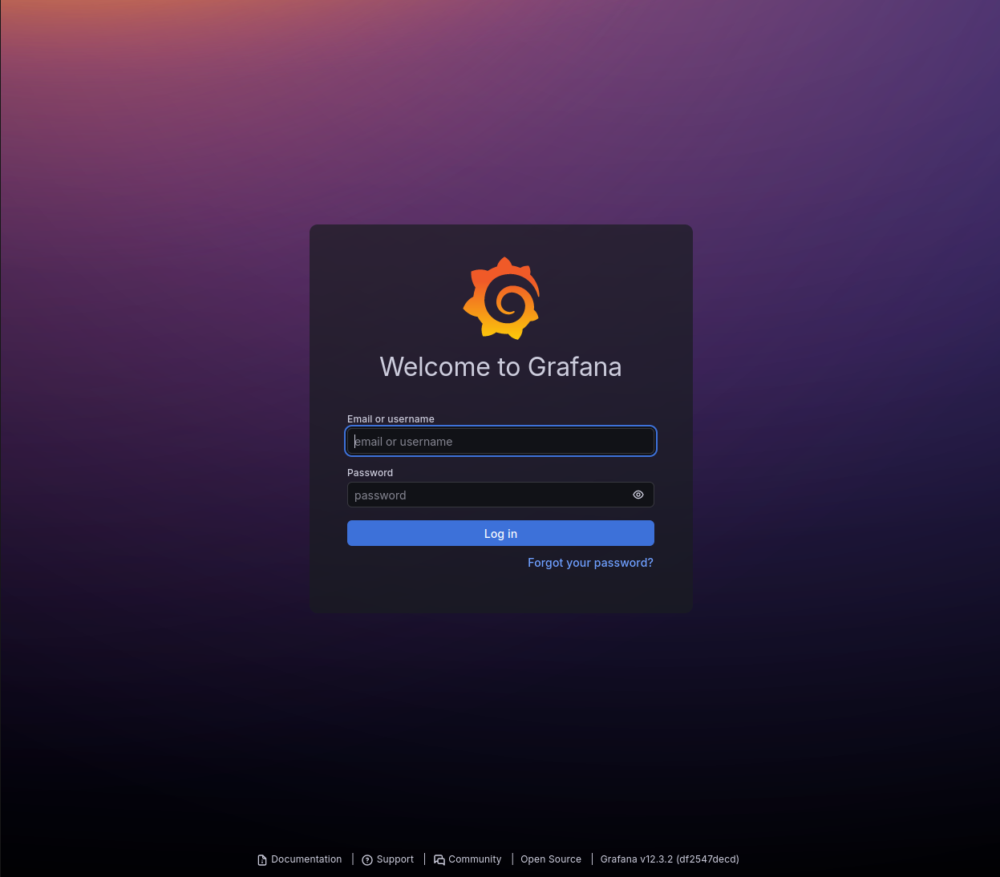
</figure>

Al ser la primera vez que accedemos, iniciaremos sesión con las credenciales predeterminadas, siendo estas:

* Usuario: `admin`
* Contraseña: `admin`

Cuando le demos a log in, nos solicitará establecer una nueva contraseña. Podemos continuar usando admin dándole al botón de skip, pero en mi caso la cambiaré y será:

```text
D*******7
```

<figure>
  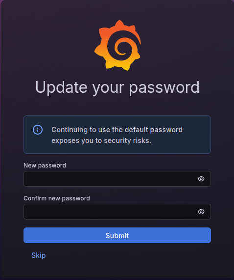
</figure>

Ya decidida la contraseña, le damos a submit y automáticamente nos redirige a la web de Grafana con las distintas opciones que nos brinda.

<figure>
  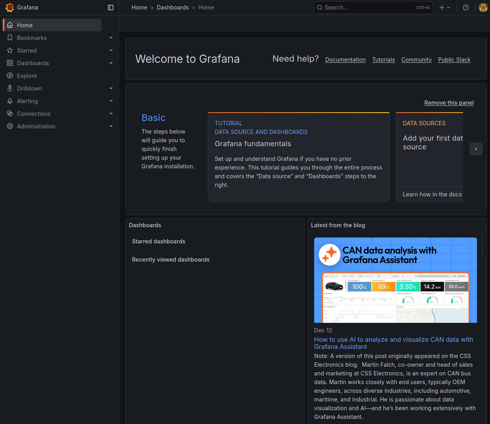
</figure>

---

## 21. Añadir Loki como Data Source en Grafana

El paso siguiente, cuando ya hemos podido acceder, será el de agregar Loki como fuente de datos en Grafana. Para ello, en la interfaz de Grafana, iremos al apartado **"Connections"** en el menú lateral y seleccionaremos **"View configured data sources"**.

<figure>
  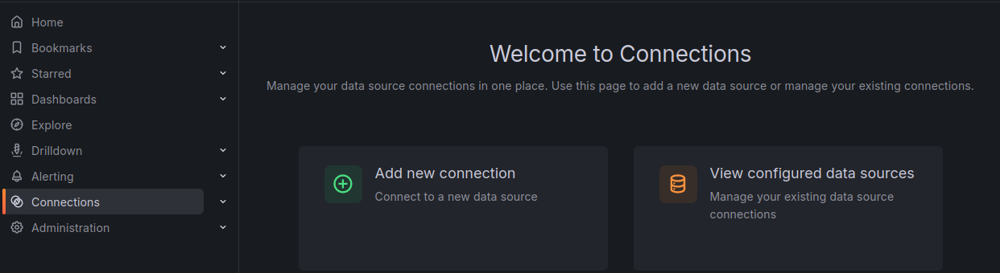
</figure>


Una vez le damos a la opción que hemos indicado anteriormente, nos saldrá la opción **“Add data source”**.

<figure>
  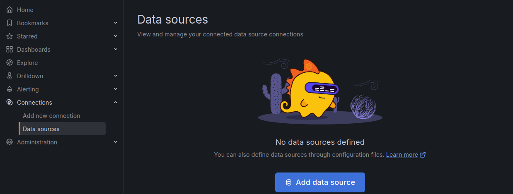
</figure>


Hacemos clic en **"Add data source"** y seleccionamos **Loki** como fuente de datos.

<figure>
  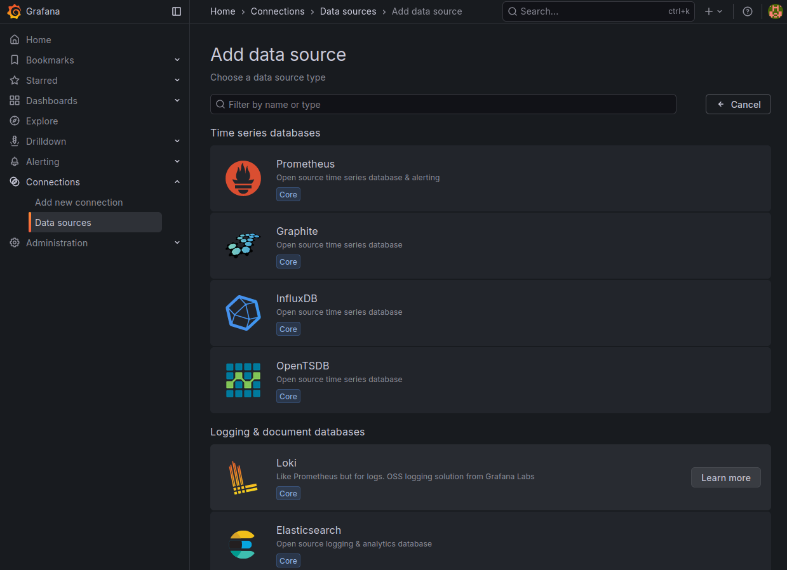
</figure>

<figure>
  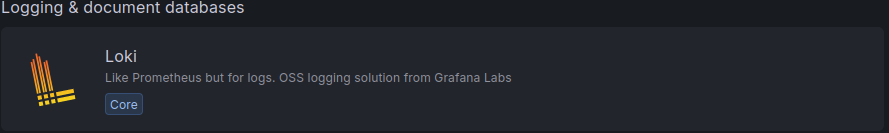
</figure>


Una vez seleccionado, en el campo URL, ponemos la dirección de Loki, por ejemplo en mi caso es la siguiente:

```text
http://localhost:3100
```

<figure>
  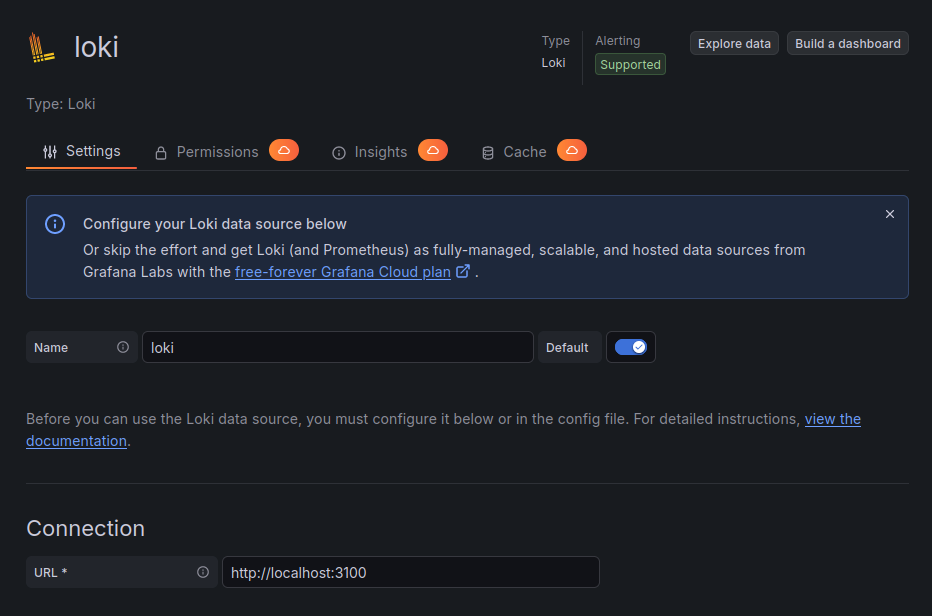
</figure>
<figure>
  
</figure>

Hacemos clic en **"Save & Test"** abajo del todo para asegurarnos de que Grafana puede conectarse a Loki correctamente.

<figure>
  
</figure>

---

## 22. Creación de Dashboard en Grafana (visualización de logs)

Ahora, con Loki configurado como fuente de datos de Grafana, probaremos a crear un Dashboard para visualizar los logs de Suricata de una forma más intuitiva y eficiente.

Para ello, en el menú lateral de Grafana, hacemos clic en **“Dashboard"**, y nos saldrá el panel siguiente, donde haremos clic en **Create dashboard**.

<figure>
  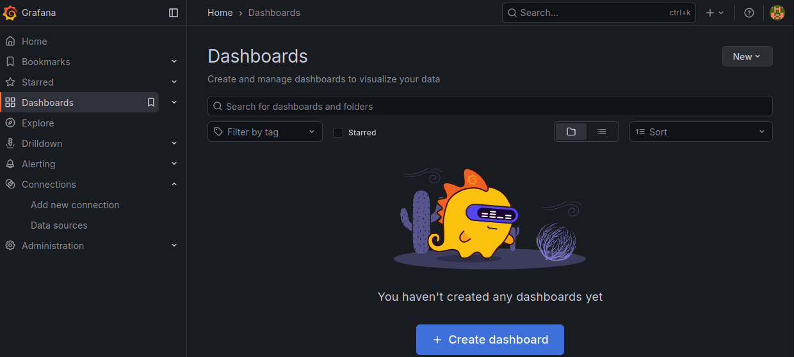
</figure>

Cuando le demos, nos saldrá lo siguiente, y elegiremos la opción de **“Add visualization”**.

<figure>
  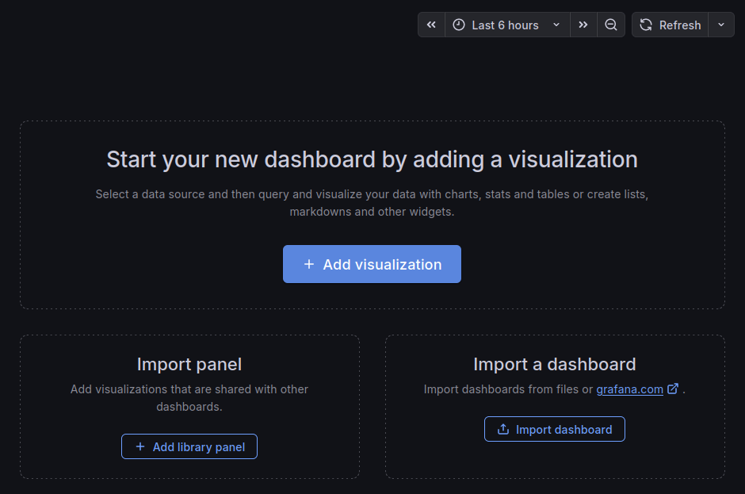
</figure>

Se nos abrirá una ventana donde elegiremos **Loki**.

<figure>
  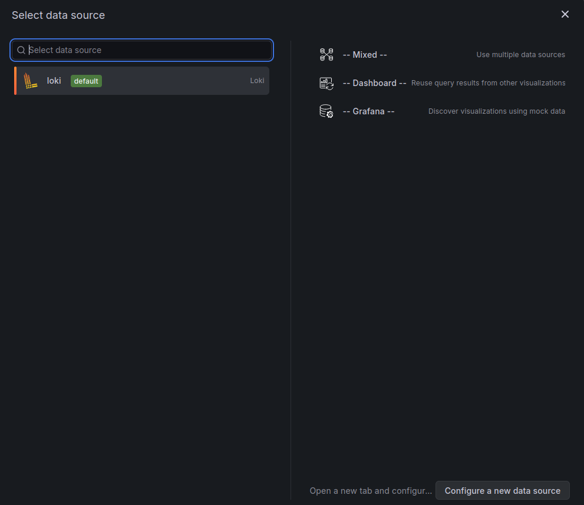
</figure>

Seguidamente, se nos abrirá el panel de creación y configuración del Dashboard que queramos añadir.

<figure>
  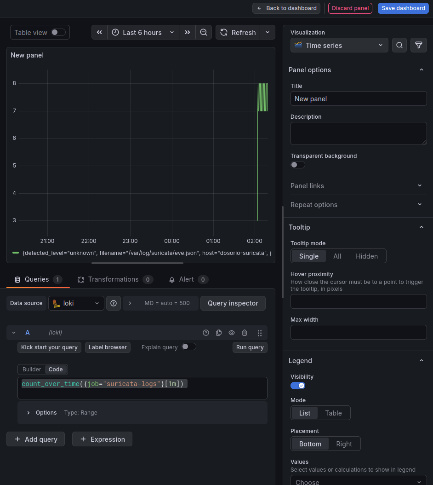
</figure>

Como se puede observar en la imagen, en la parte de abajo-izquierda, seleccionaremos la opción **“queries”**, que es donde introduciremos el código en el cual indicamos qué queremos usar para recibir los datos y, seguidamente, mostrarlos gráficamente.

En el caso de la imagen anterior, mostraremos por pantalla el número de paquetes bloqueados por minuto con una línea temporal automática.

Le damos a guardar el dashboard y el nombre que le daremos será **“Suricata-Monitorización”**.

Cuando volvamos a clicar en dashboards, nos debería salir de la siguiente manera.

<figure>
  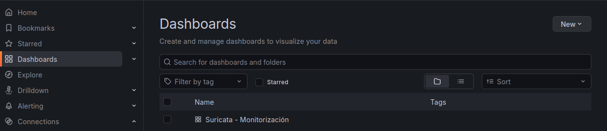
</figure>

Si clicamos en **Suricata-Monitorización**, se nos abrirá nuestro dashboard recientemente creado, indicando la hora en la que se han detectado ataques o conexiones entre las redes que estamos monitorizando.

<figure>
  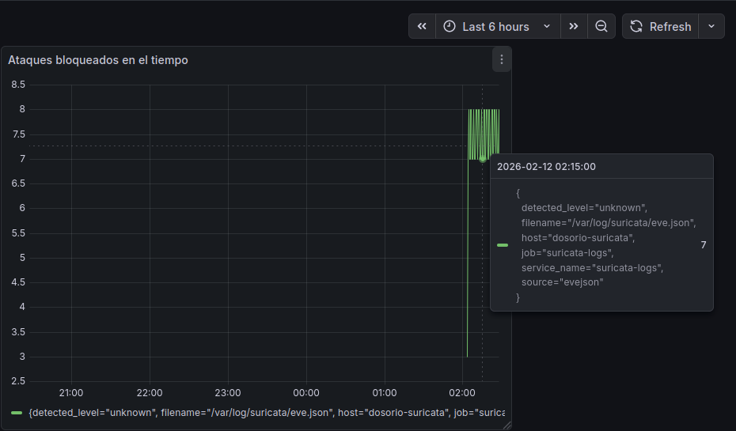
</figure>

---

## 23. Mejora de dashboards (más intuitivos y con leyendas por tipo de evento)

Pero de momento no se entiende muy bien la información que nos muestra. Por lo tanto, crearemos unos cuantos Dashboards más, que nos muestren información de manera más intuitiva. También editaremos este que acabamos de crear indicando claramente qué tipo de movimientos detecta, es decir, intentaremos que en la leyenda muestre en distintos colores si detecta un ping, un intento de SSH, etc.

Así nos quedarían los dashboards una vez ajustados, haciéndolos mucho más gratificantes a la vista.

<figure>
  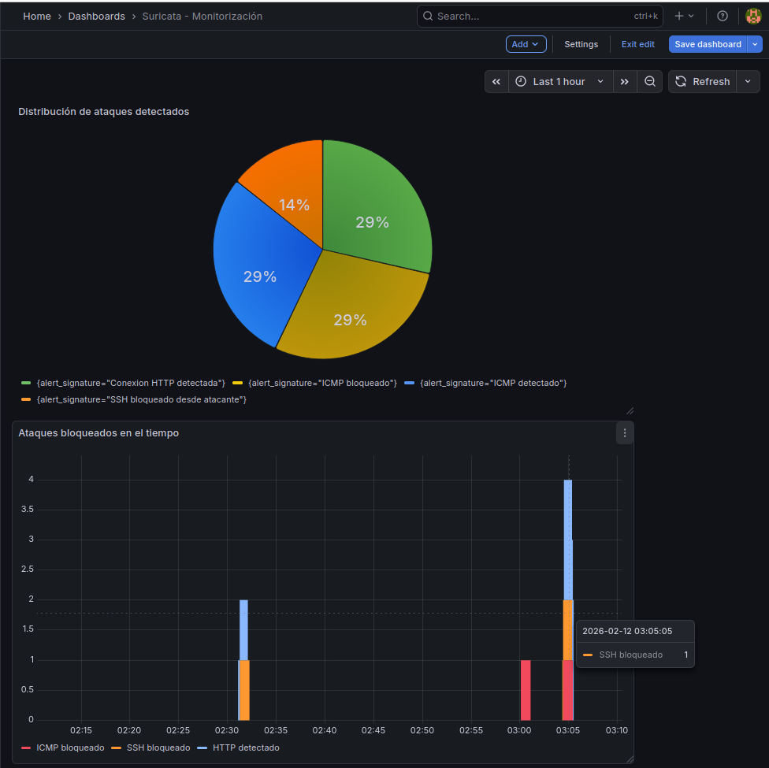
</figure>

Con esto, damos por completada con éxito la implementación tanto del monitoreo de Suricata como de las distintas herramientas que hemos utilizado para poder verlo de forma más intuitiva.
